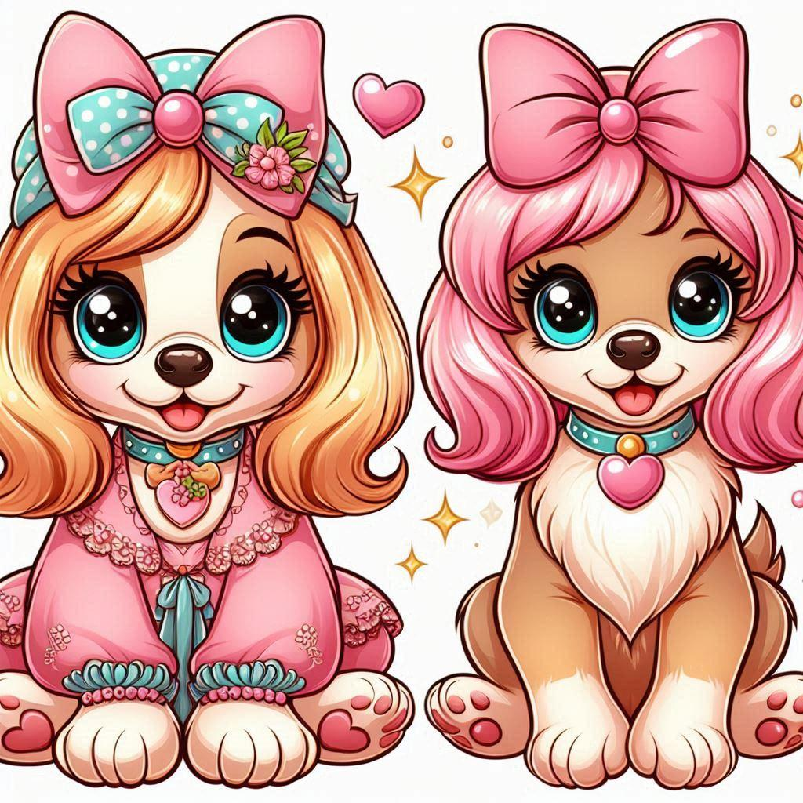
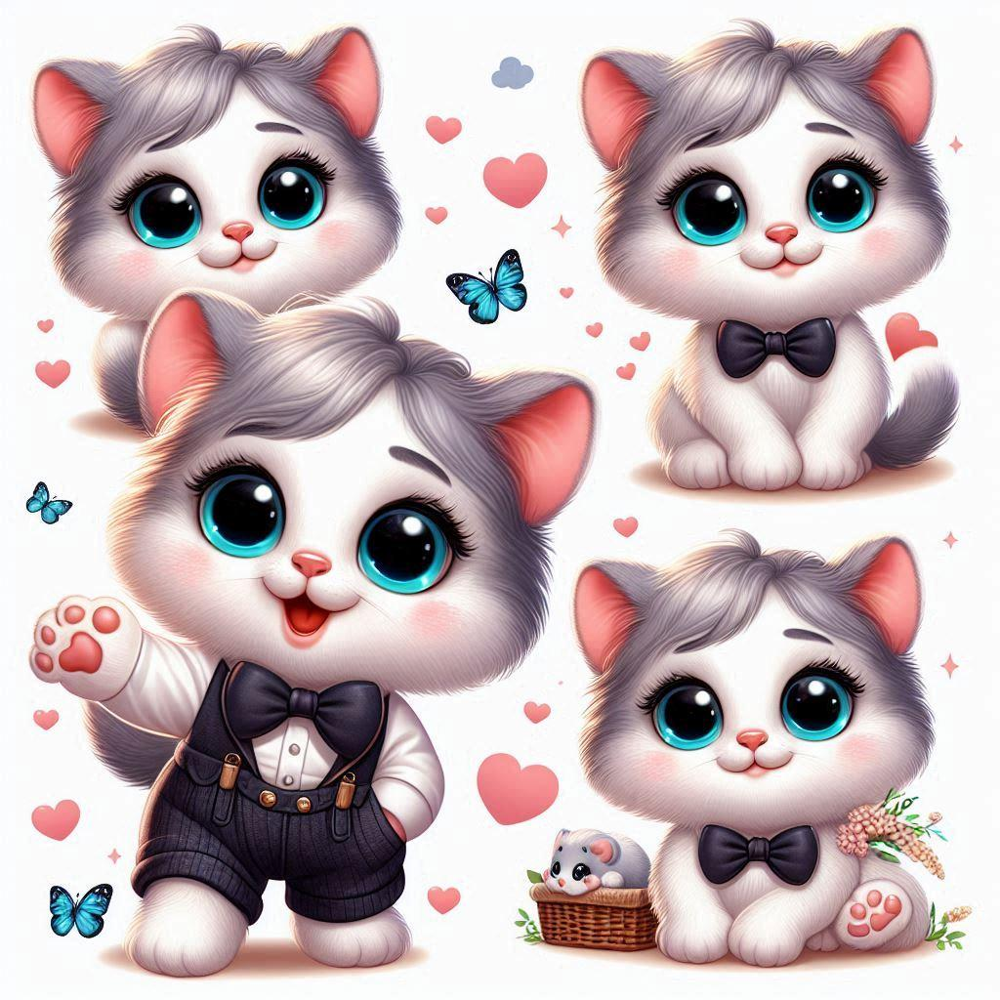
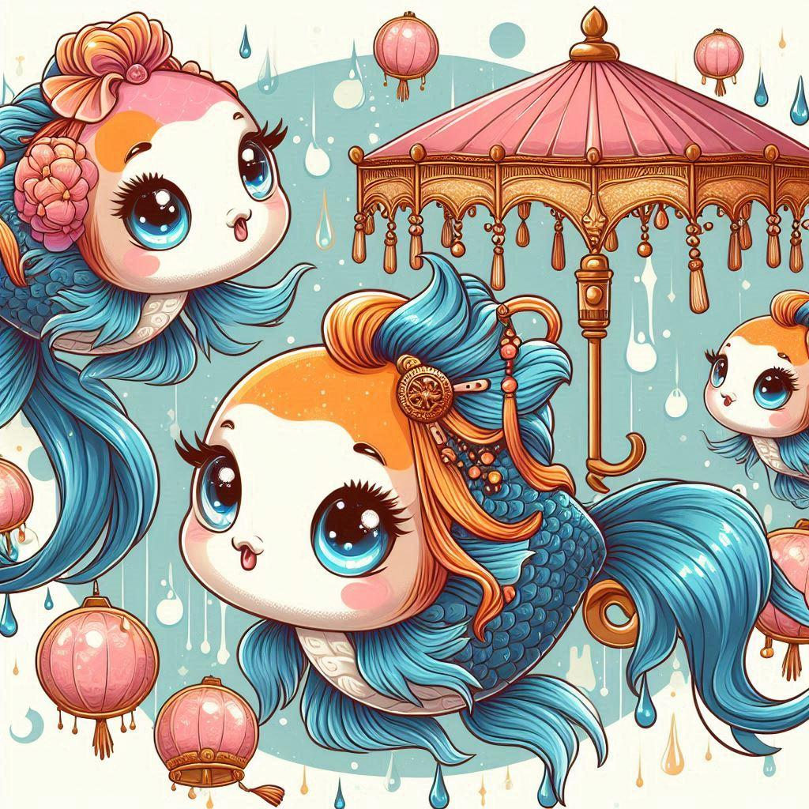

<!DOCTYPE html>
<html lang="en">
<head>
  <meta charset="UTF-8">
  <meta name="viewport" content="width=device-width, initial-scale=1">
  <title>Nyla's Playhouse: Module 3 Assignment</title>
  <link rel="stylesheet" href="css/bootstrap.min.css">
  <link rel="stylesheet" href="css/style.css">
  <link href='https://fonts.googleapis.com/css?family=Oxygen:400,300,700' rel='stylesheet'>
  <link href="https://fonts.googleapis.com/css2?family=Playwrite+DE+VA:wght@100..400&display=swap" rel='stylesheet'>
</head>
<body>
  <header>
    <nav id="header-nav" class="navbar navbar-default">
      

        

          <button type="button" class="navbar-toggle collapsed" data-toggle="collapse" data-target="#collapsable-nav" aria-expanded="false">
            Toggle navigation
            
            
            
          </button>
          <a href="index.html" class="pull-left visible-md visible-lg">
            

          </a>
          

            <h1>Nyla's Playhouse</h1>
            

              
              Nyla Certified
            

          

        

        

          <ul id="nav-list" class="nav navbar-nav navbar-right">
            <li class="dropdown">
              <a href="#" class="dropdown-toggle" data-toggle="dropdown" role="button" aria-expanded="false">
                  Menu </a>
              <ul class="dropdown-menu">
                <li>
                  <a href="#">
                     Playhouse Friends</a>
                </li>
                <li>
                  <a href="#">
                     Playhouse Rules</a>
                </li>
                <li>
                  <a href="#">
                     Nyla's Memories</a>
                </li>
              </ul>
            </li>
          </ul>
        

      

    </nav>
  </header>
  

    

      
    

    <h1 class="text-center">Playhouse Friends</h1>
    

      

        

          
Puppies

          
          
Meet the epitome of boundless energy and unconditional love. Puppies, with their fluffy fur and wagging tails, bring an infectious joy to every corner they explore. Whether they're playfully chasing after a ball or cuddled up for a nap, their adorable antics warm hearts and make even the toughest day brighter.

        

      

      

        

          
Kittens

          
          
Soft purrs and mischievous eyes define the charm of kittens. With their playful pounces and graceful stretches, these tiny felines effortlessly weave their way into our lives. From exploring new heights to curling up in cozy corners, their curiosity and independence shine through, capturing hearts with each whisker twitch.

        

      

      

        

          
Fish

          
          
Beneath the shimmering surface of an aquatic world, fish glide with elegance and tranquility. From the vibrant hues of tropical fish to the serene movements of koi in a pond, each species tells a tale of underwater grace. Their tranquil presence and mesmerizing beauty bring a sense of peace and wonder, inviting us to glimpse a world of silent enchantment below the waves.

        

      

    

  

  <!-- jQuery (Bootstrap JS plugins depend on it) -->
  
  
  <script src="js/script.js
